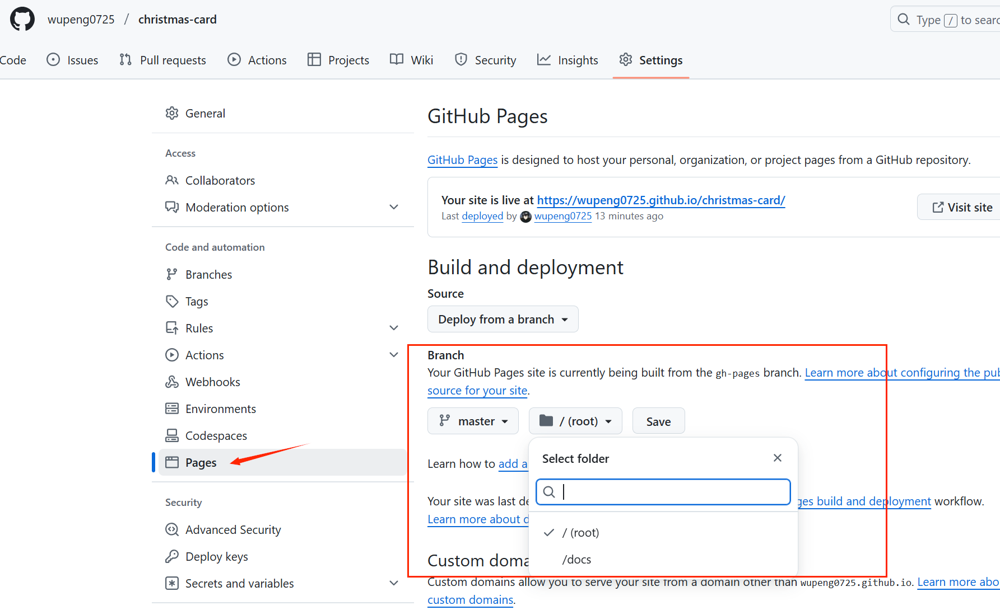

# threejs制作的3D圣诞卡片

## 技术栈：vue3+vite+threejs

> 演示地址：https://wupeng0725.github.io/christmas-card/

效果图如下：


## `github.io` 项目搭建步骤

先看一下 `vite.config.js`的配置

```js
export default defineConfig({
  plugins: [vue()],
  base: process.env.NODE_ENV === 'production' ? '/christmas-card/' : '/',
  build: {
    outDir: 'docs', // 使用 GitHub Pages默认识别目录
    assetsDir: 'static' // 静态资源子目录
  },
  assetsInclude: ['**/*.hdr', '**/*.glb'] // 如果这些文件放在Public下就不用配置
})
```
> 注意：我这里生产环境是放在一个 `/christmas-card/`目录下的。默认情况下访问 `https://wupeng0725.github.io/christmas-card/（我最终部署的网站地址）` 是会提示public下的文件访问不到的（比如`public/draco`）。
> 因为**默认是访问 `/` 根目录下的文件信息**。
> 所以我写了一个公共方法，放在 `src/utils/index.js` 下：
> `````js
> export function withBase(path) {
>  return import.meta.env.BASE_URL + path.replace(/^\//, '')
>}
> ```
> 具体使用去 `App.vue` 查找 `withBase` 方法用法即可。

### 项目搭建方式：

* 方式一：将docs文件和项目源码放在同一个仓库的同一个分支，那直接去GitHub Pages下进行配置即可.



> 不过这里需要注意：默认vite打包目录是dist，需要去vite.config.js配置
> ```js
> build: {
>    outDir: 'docs', // 使用 GitHub Pages默认识别目录
>    assetsDir: 'static' // 静态资源子目录
>  },
>```

`我是使用方式二的`

* 方式二：将docs文件和项目源码文件放在同一个仓库的不同分支下

源码文件放在master分支，docs放在gh-pages分支（这也是github官网推荐的分支名称）

对于源码文件的上传下载，我就不啰嗦了，就是正常使用git即可。

对于docs放在gh-pages分支的操作这里详细说一下：

1. 使用 `gh-pages` 工具自动化实现 docs文件的发布和部署。
   > gh-pages：本质上是一个专门用于将本地生成的静态文件部署到 GitHub Pages 的工具。主要功能就是将指定目录下的静态文件推送到 GitHub 仓库的 gh-pages 分支（也可指定其他分支 ），以实现静态网站在 GitHub Pages 上的托管展示。

   1.1 安装 `gh-pages` 工具
   ```bash
   npm install gh-pages --save-dev
   ```

   1.2 在 `package.json` 中配置 `gh-pages` 工具
   ```json
   "deploy:github": "gh-pages -d docs -b gh-pages -r https://github.com/wupeng0725/christmas-card.git"
   ```
   > 这里说明一下 `-d` 就是指向你的包目录，，`-b` 指向你的分支，`-r` 指向你的仓库地址（**必须是url，仓库别名不生效**）。
   > **如果你的仓库名称是origin，那可以不用  `-r` 了。我加是因为我有远程两个仓库，gitee（origin）和github（github），括号里是远程仓库名称。**

   1.3 执行 `npm run deploy:github` 即可自动化部署到 `gh-pages` 分支下

---

1. 手动上传docs文件到gh-pages分支

    2.1 生成 docs 目录：

    ```bash
    npm run build
    ```

    2.2 强制将 docs 添加到 Git 跟踪
    > 我们在`.gitignore`文件中 排除了 `docs`。
    > 所以我们需要强制添加到git跟踪。
  
    使用命令：
    ```bash
    git add -f docs
    git commit -m "Temp: Add docs for deployment"
    ```
    
    2.3 使用 `git subtree` 推送到 `gh-pages`
    
    将 docs 目录推送到远程 `gh-pages` 分支：
    ```bash
    git subtree push --prefix docs github(或者用你设置的远程仓库名称) gh-pages
    ```
    2.4 撤销主分支的 dist 提交（可选）
    推送后，若不想在主分支保留 dist 的提交记录：
    ```bash
    git reset HEAD~1 --hard  # 撤销最后一次提交并丢弃更改
    ```

**最后，推荐你 使用方式二的 `gh-pages` 自动化。**